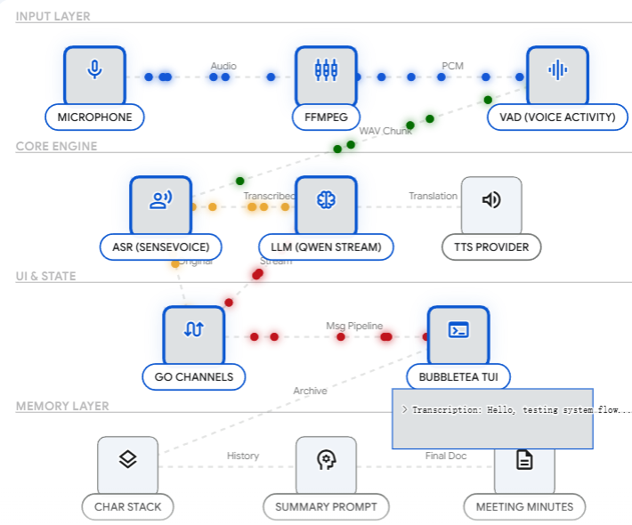
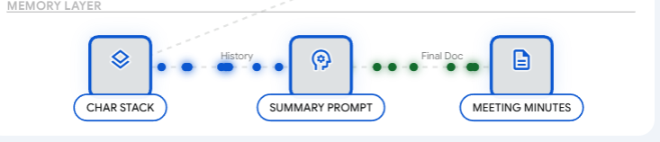

# 🎙️ Mini-TMK-Agent


Mini-TMK-Agent 是一个基于 Go 语言开发的高性能、跨平台的命令行同声传译智能体。本项目旨在通过极其轻量级的 CLI 交互，提供包含**实时静音检测(VAD)**、**流式大模型翻译**、**极客终端UI(TUI)** 以及 **智能会议纪要(Agent)** 在内的全链路同传体验。

本项目作为云平台同传 Agent 的探索性原型，底层全面接入了兼容 OpenAI 规范的聚合大模型 API（默认采用 SiliconFlow 硅基流动，支持 SenseVoice 识别与 Qwen 翻译）。

---

## ✨ 核心特性 (Core Features)

* **🚀 极速流式同传 (Stream Mode)**
  * **自研轻量级 VAD**：基于 RMS 能量阈值的实时音频流切片，丢弃传统的死板定时切片，实现真正的“人停即翻”。
  * **跨平台声卡直采**：通过动态指令路由，完美兼容 Windows (`dshow`)、macOS (`avfoundation`) 和 Linux 的原生麦克风。
  * **流式打字机交互**：基于 `BubbleTea` 终端状态机，利用多路复用 Channel 实现无阻塞的流式翻译字幕滚动与光标闪烁效果。
* **🤖 智能体记忆闭环 (Agentic Memory)**
  * 自动记录会议上下文，在用户退出 (`Ctrl+C`) 时进行拦截，并调用 LLM 自动生成 Markdown 格式的专业会议纪要。
* **🎧 语音合成播报 (TTS Integration)**
  * 翻译完成后，后台异步启动语音合成与静默播放 (`ffplay`)，实现真正的“同声传译”闭环。
* **📄 本地离线转录 (Transcript Mode)**
  * 支持对本地高质量音频文件进行批量识别与翻译，并输出标准的纯文本文件。

---

## 🏗️ 架构设计 (Architecture)


本项目严格遵循 Go 语言经典工程规范：
* **解耦与防腐层 (ACL)**：通过定义 `ASRProvider`、`LLMTranslator` 和 `TTSProvider` 接口，将核心业务逻辑与底层第三方 API 强力解耦。
* **并发流水线模型**：在流式模式下，采用了 `Goroutine` + `RingBuffer` + `Channel` 的多级并发架构，确保音频采集、ASR 识别、LLM 翻译、TTS 播报和 UI 渲染互不阻塞。
* **Fail-Fast 机制**：启动时对关键配置和依赖进行强校验，避免运行时崩溃。

---

## 🛠️ 安装与配置 (Installation)

### 1. 前置依赖
* **Go 1.21+**
* **FFmpeg** (必须安装并加入系统环境变量，用于底层音频流处理与 TTS 播放)
  * Windows: `winget install Gyan.FFmpeg`
  * macOS: `brew install ffmpeg`
  * Linux: `sudo apt install ffmpeg`

### 2. 获取代码与配置
```bash
git clone [https://github.com/your-username/mini-tmk-agent.git](https://github.com/your-username/mini-tmk-agent.git)
cd mini-tmk-agent

# 配置环境变量
cp .env.example .env
```
请在 `.env` 文件中填入你的 API Key 和 BaseURL（推荐使用 SiliconFlow 获取免费额度）。

`.env` 示例：
```env
ASR_API_KEY=sk-your-siliconflow-key
ASR_URL=[https://api.siliconflow.cn/v1](https://api.siliconflow.cn/v1)
LLM_API_KEY=sk-your-siliconflow-key
LLM_URL=[https://api.siliconflow.cn/v1](https://api.siliconflow.cn/v1)
LLM_MODEL=Qwen/Qwen2.5-7B-Instruct
```

### 3. 编译运行
```bash
# 下载依赖
go mod tidy

# 编译二进制文件
go build -o mini-tmk-agent ./cmd/mini-tmk-agent
```

---

## 🚀 快速开始 (Quick Start)

### 模式一：流式同传与智能体总结 (Stream Mode)
启动持续监听电脑麦克风的流式同传。Agent 会在屏幕上打印双语字幕，播放翻译语音，并在退出时生成总结。

```bash
# 默认中翻英
./mini-tmk-agent stream --source-lang zh --target-lang en

# 支持的其他语种组合 (如中翻日、西翻英)
./mini-tmk-agent stream --source-lang zh --target-lang ja

# 指定麦克风设备 (仅 Windows 多虚拟设备用户可能需要)
./mini-tmk-agent stream --mic "audio=麦克风阵列 (2- Realtek(R) Audio)"
```

### 模式二：音频文件转录 (Transcript Mode)
对本地音频文件进行识别翻译，并保存到目标路径。
```bash
./mini-tmk-agent transcript -f ./testdata/meeting.wav -o ./output/result.txt
```

---

## 🧪 单元测试 (Testing)
本项目包含核心 VAD 算法（RMS 能量计算）与环境配置防崩溃机制的自动化单测：

```bash
go test ./... -v
```